A all in one solution for tour and travel in Lebanon. Find the best locations, hotels, restaurants, and more, locate them on the map, and get access to reviews and ratings.

You liked a place? Add it to your favorites and share it with your friends.
Want to plan a trip? Create a trip and add the places you want to visit to it. Order them by the order you want to visit them!

<h1>Stack 📚</h1>

</img>
</img>
</img>
</img>
</img>
</img>

</img>
</img>

 
 

<h1>Installation 🛠</h1>

<pre>
git clone https://github.com/Murf-y/Tourify.git
</pre>

## Client:

<pre> 
cd Tourify
npm install
ionic serve
</pre>

Do Not Forget to add your own MAP API key in the environment.ts file

## Server:

Run XAMPP and start the Apache and MySQL servers.

<pre>
cd Tourify/api
</pre>

run the **_run_once.php_** file to create the database and tables and insert the categories and places.

<h1>Emails 📧</h1>

For emails to work, you need to add your own email and password in the **_sendmail.ini_** file, and you need to set the following settings in php.ini file:

<pre>
[mail function]
SMTP=smtp.gmail.com
smtp_port=587
sendmail_from = tourify.in@gmail.com
sendmail_path = "\"C:\xampp\sendmail\sendmail.exe\" -t"
</pre>

In the **_sendmail.ini_** file, you need to add your email and password:

<pre>
[sendmail]

smtp_server=smtp.gmail.com
smtp_port=587
error_logfile=error.log
debug_logfile=debug.log
auth_username=tourify.in@gmail.com
auth_password=gmail_password  <- PUT PASSWORD HERE
force_sender=tourify.in@gmail.com
</pre>

<h1> Database Schema 📊</h1>

 
 

<h1>FULL Preview 📸 </h1>
Full application design can be found in design folder (figma file) OR BELOW 👇

 

    
    
    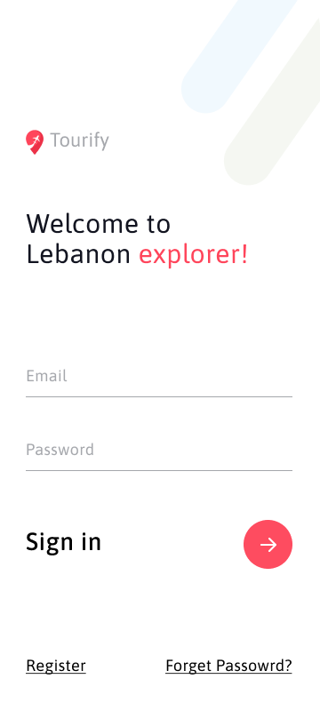
    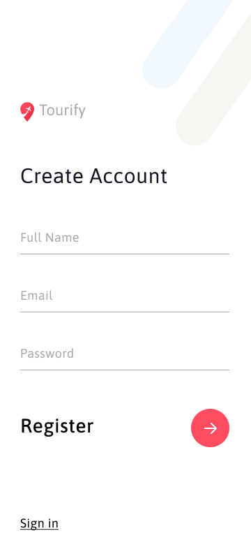

 

    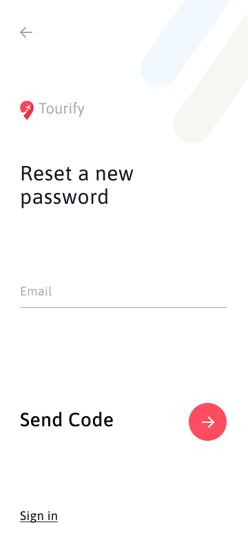
    
    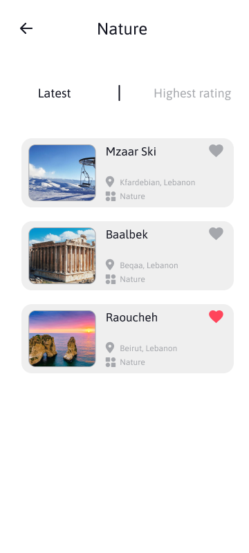
    

 

    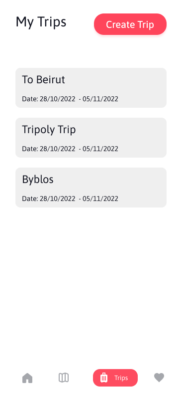
    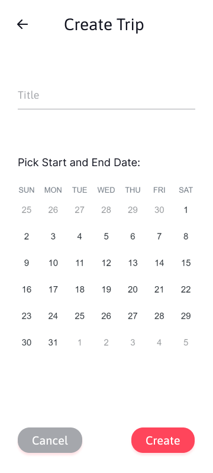
    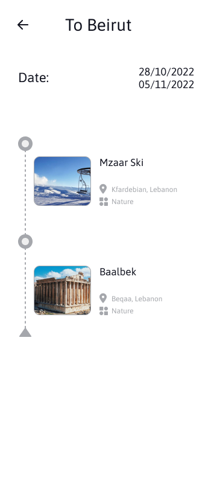
    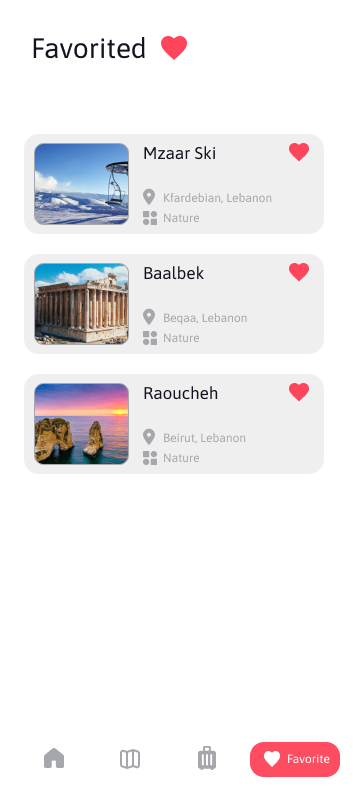

 

    
    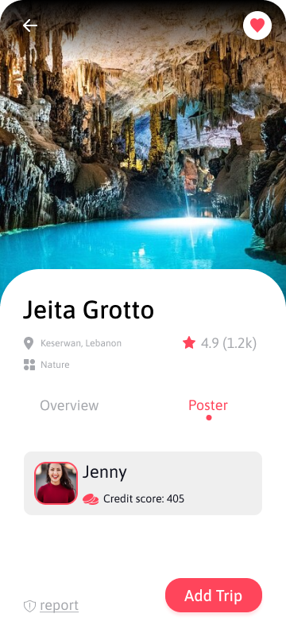
    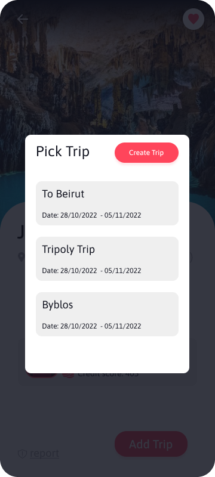

 

    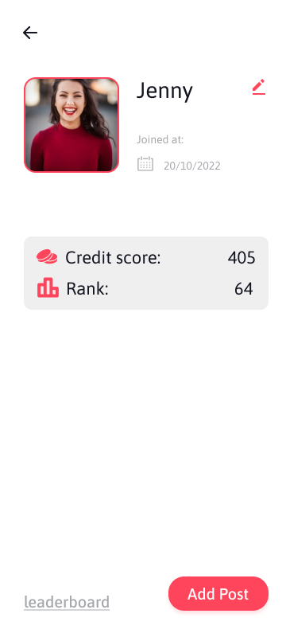
    
    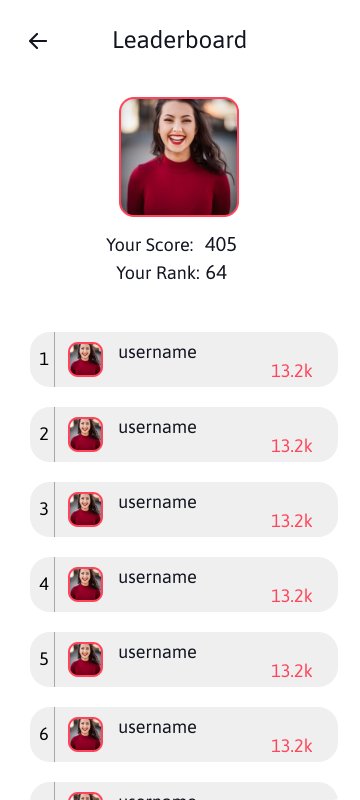
    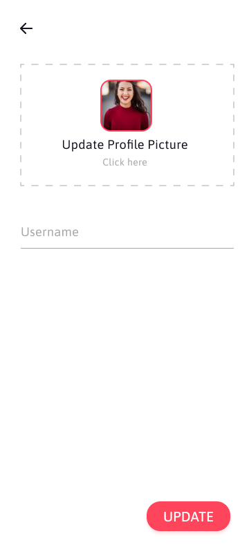

   
<h1> License 📜</h1>

This project is licensed under the MIT License - see the [LICENSE](LICENSE) file for details
